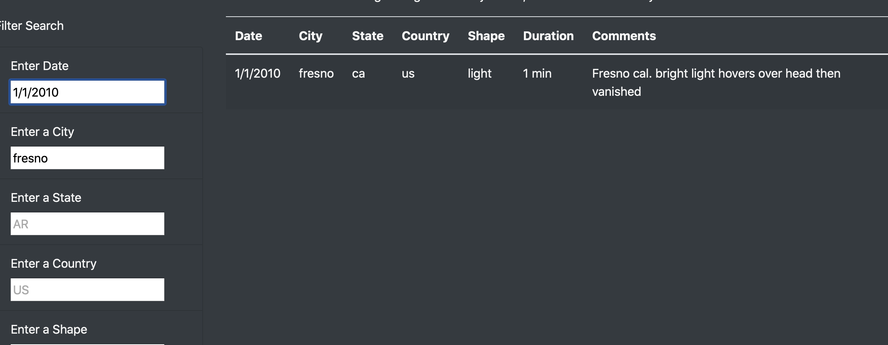

# UFOs

## Overview of the project.

The purpose of this project is to create a website that contains a table imported from JavaScrip. This table must be dynamic and able to show different results based on the user's multiple filters.

## Results.

The use of the website is pretty simple, we have the table with all of the dates for the user to add a filter they simply need to write a parameter in one of the boxes on the left and press enter, the data will be filtered automatically.

Once you have a filter table you can filter even more by adding a new parameter in another box and clicking enter.

## Summary.

One drawback I can see from the site is that there are a lot of filter parameters and this can confuse the user, I would add a drop-down list in each parameter so that the user would be able to play with the data without looking for something specific.

I also liked it better when the button enabled rather than filtering right after pressing enter.